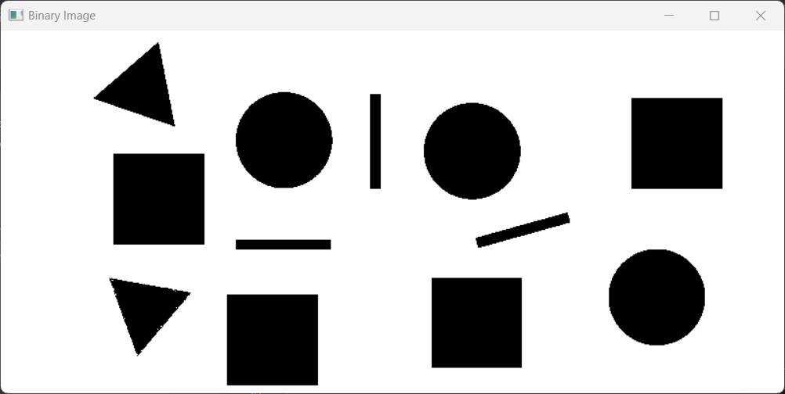

# Task 13.2
# Shape Detection

## **1. Overview**

This task demonstrates how to **detect and classify basic geometric shapes (triangles, rectangles, squares, circles)** and **identify their colors** in animated-style images using classical computer vision techniques. Unlike deep learning-based models, this approach uses classical algorithms like *edge detection*, *contour analysis*, and *color thresholding* to achieve similar results.

## 2. Our Approach
Our goal was to develop a lightweight and efficient method for reliably detecting shapes and colors in images without relying on deep learning models. We approached the problem using traditional image processing techniques, which are particularly well-suited for identifying simple geometric shapes with clear boundaries and distinct colors, such as those seen in animated images.
### **Workflow**
### 1. Preprocessing :
- The input image is preprocessed (converted to grayscale) to enhance its edges for better shape detection. 
### 2. Shape Detection :
- Edge detection is performed, followed by contour analysis and shape approximation to classify shapes.
### 3. Color Detection :
- We looked up several methods, watched a number of tutorials, and tried to follow them untill we achieved our goal.
### 4. Result Visualization :
- The identified shapes and their corresponding colors are drawn on the image.

## 3. Algorithims and Techniques
### 3.1 Image Preprocessing
Before detecting shapes, the input image undergoes basic preprocessing to improve edge detection results:
- **Grayscale Conversion:** Converting the image to grayscale simplifies the edge detection process by focusing on intensity differences rather than color.


### 3.2 Edge Detection
The edge detection is performed using **thresholding** and **contour detection**.
- **Thresholding:** After the image is converted to grayscale, thresholding is applied. This method converts the grayscale image into a binary image, where the pixels are either black (0) or white (255), based on a threshold value. Any pixel intensity above the threshold is set to white (255), and any pixel intensity below is set to black (0).
    ```
    _, thresh_image = cv2.threshold(gray_image, 220, 255, cv2.THRESH_BINARY)
    ```
    
- **Contour Detection:** Contours are extracted using the `findContours() `function in OpenCV to detect the contours (boundaries) of shapes directly from the binary (thresholded) image. The output is a list of contours, where each contour is a collection of points that represent the edge of a shape.

### 3.3 Shape Detection
Contours are then approximated to polygons using the **Douglas-Peucker algorithm** (`cv2.approxPolyDP()`), which simplifies the contour shape. The shape is classified based on the number of vertices:
- **Triangle:** If the contour has 3 vertices.
- **Rectangle/Square:** If the contour has 4 vertices, we calculate the aspect ratio (width/height). If it's near 1, the shape is classified as a square; otherwise, it’s a rectangle.
- **Circle:** If the contour has many vertices and forms a smooth boundary, it’s classified as a circle.


### 3.4 Color Detection 
The shapes' colors are determined by RGB value comparison. the function `get_color_name(b, g, r)` takes the pixel's Blue (B), Green (G), and Red (R) values from the image, and then compares them against predefined thresholds to assign a color label. If the red channel is dominant and the green and blue channels are low, it's classified as "Red" and so on. Combinations of high values in several channels are examined for more complicated colors such as Magenta, Yellow, and Cyan. This technique may have trouble with complex or nuanced lighting situations, but it performs well on straightforward images with a small color palette.


## 4. Challenges and Insights
### 4.1 Challenges
- **Windows and Frames as Shapes:** Large non-shape objects like windows or image frames were detected as shapes. To mitigate this, contour area filtering was used.
### 4.2 Insights
- **Efficiency of Classical Methods:** For tasks like detecting **basic geometric shapes** in clean images (e.g., animated images or line drawings), classical methods can be highly efficient. They are lightweight and require no training data.
- **No Need for Deep Learning for Simple Tasks:** For simple shape and color detection tasks in clean, controlled environments, classical methods are often sufficient, eliminating the need for computationally expensive deep learning models.
- **Contour Detection Limitations:** Contour detection based on thresholding works great for clear, well-separated shapes. However, if the shapes overlap or are not well-separated, this method might struggle, resulting in incomplete or incorrect contours.

## 5. Running the Project
### 5.1 Prerequisites:
- `opencv-python`
- `numpy`
- `tkinter`

You can install them using `pip`:
```
pip install opencv-python numpy
```

### 5.2 Running the Program
1. Run the `main.py` script.
2. Select an image file using the file dialog.
3. The detected shapes and colors will be displayed in a new window.
4. The output image will also be saved as `processed_image.jpg`.
```
python main.py
```

